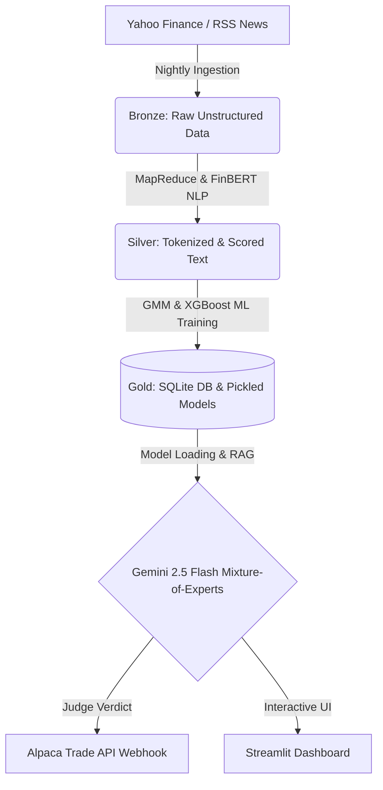

<h1 align="center">📈 Autonomous Macro-Sentiment Agentic Pipeline</h1>

<p align="center">
  <a href="https://macro-sentiment-agentic-pipeline.streamlit.app/"><strong>Live Dashboard</strong></a> ·
  <a href="#-quickstart--development"><strong>Quickstart</strong></a> ·
  <a href="#-tech-stack--api-costs"><strong>Tech Stack & Costs</strong></a>
</p>

<p align="center">
  
  
  
  
  
</p>

> **Disclaimer:** This project is produced solely for educational and academic research purposes. Nothing in this repository constitutes investment advice, a solicitation, or a recommendation to buy, sell, or hold any security or financial instrument. Algorithmic trading carries significant financial risk. The creators are not liable for any financial losses incurred from using this simulated system.

> **⚡ 100% Autonomous Execution** • **🧠 Multi-Agent MoE Debate** • **📊 Offline ML Model Training** • **🐳 Docker Containerized**

## 📖 Overview
An autonomous, multi-agent AI pipeline that synthesizes macro volatility and NLP sentiment to predict market anomalies, orchestrate MoE analyst debates, and execute algorithmic trades.

### 🌟 Enterprise-Grade Architecture
* **🤖 Text-to-SQL Database Agent:** Integrates Gemini 2.5 Flash as an active query agent, allowing users to interrogate the historical SQLite database using natural language.
* **🧠 Agentic Memory Loop:** The system permanently archives AI-generated crisis reports back into the database, allowing current agents to retrieve and learn from the conclusions of past agents during similar market regimes.
* **📊 Offline ML Clustering & Prediction:** Utilizes Unsupervised Machine Learning (Gaussian Mixture Models) and an XGBoost/Random Forest champion model, trained offline via nightly pipelines to ensure lightning-fast UI performance.
* **🌐 Big Data MapReduce & Stop-Word Filtering:** A custom Python MapReduce algorithm processes thousands of financial headlines to extract live "Trending Macro Themes."
* **⚖️ 100% LLM-Driven MoE Debate:** Adversarial AI agents (Optimistic vs. Pessimistic) debate historical market context before a Lead Judge synthesizes a final verdict.
* **💸 Autonomous Execution Webhook:** Closes the automation loop by hooking the Judge agent's verdict directly into the **Alpaca Trading API**.

---

## 🏗️ System Architecture (Medallion Data Pipeline)



This project utilizes an industry-standard **Medallion Data Architecture**:

1. **Bronze Layer (Raw Ingestion):** Ingests real-time Yahoo Finance RSS feeds alongside historical market data (DJIA & VIX) via daily cron jobs.
2. **Silver Layer (Transformation):** Deploys a **FinBERT NLP** model to score sentiment and utilizes a custom **MapReduce** algorithm to process thousands of financial headlines into clean, filtered themes.
3. **Gold Layer (Business Ready):** Trains **XGBoost** and **Gaussian Mixture Models (GMM)** offline, exporting `.pkl` artifacts and securely archiving autonomous AI memory logs for the decoupled Streamlit dashboard to consume instantly.

---

## 🗂️ Repository Structure

```text
Macro-Sentiment-Agentic-Pipeline/
├── .github/workflows/
│   └── pipeline.yaml        # Zero-maintenance CI/CD cron job for nightly execution
├── app.py                   # Streamlit interactive dashboard & UI logic
├── pipeline.py              # Backend ETL, ML clustering, and LaTeX report generation
├── champion_model.pkl       # Pre-trained predictive ML model artifact
├── gmm_model.pkl            # Pre-trained clustering ML model artifact
├── requirements.txt         # Version-locked Python dependencies
├── Dockerfile               # Containerization blueprint for cloud deployment
├── .gitignore               # Security and environment file exclusions
├── LICENSE                  # MIT License
└── README.md                # Project documentation and architecture
```

---

## 💻 Tech Stack & API Costs

| Service / Technology | Role in Architecture | Cost / Limit Profile |
|----------------------|----------------------|----------------------|
| **Google Gemini 2.5 Flash** | Multi-Agent Debate, Knowledge Graph, Text-to-SQL | Free Tier (15 RPM) |
| **HuggingFace FinBERT** | NLP Sentiment Scoring | Local Compute ($0) |
| **Alpaca Trade API** | Algorithmic Execution Webhook | Paper Trading ($0) |
| **Scikit-Learn & XGBoost** | Champion Modeling, Gaussian Mixture Models | Local Compute ($0) |
| **Apache MapReduce Logic** | Big Data Stop-Word Filtering | Local Compute ($0) |
| **GitHub Actions** | CI/CD Automation & Nightly Cron Jobs | Free Tier |
| **Streamlit Community** | Live Dashboard Hosting | Free Tier |

---

## 🚀 Quickstart & Development

> **🗝️ Prerequisite: API Keys**
> To run the interactive AI agents locally or via the web deployment, you will need a free Google Gemini API key. To enable live algorithmic trading, you will need Alpaca Paper Trading keys. Users can securely enter these directly into the application's sidebar UI.

**Option A: Standard Python Run**
```bash
# 1. Clone the repository
git clone [https://github.com/amjad-hanini/Macro-Sentiment-Agentic-Pipeline.git](https://github.com/amjad-hanini/Macro-Sentiment-Agentic-Pipeline.git)
cd Macro-Sentiment-Agentic-Pipeline

# 2. Install dependencies
pip install -r requirements.txt

# 3. Run the Backend Data Pipeline (Required for first-time setup)
# This fetches live RSS news, builds the SQLite database, and trains the ML .pkl models.
python pipeline.py

# 4. Launch the Streamlit Dashboard
streamlit run app.py
```

**Option B: Docker Deployment**
```bash
# 1. Build the Docker Image
docker build -t macro-pipeline .

# 2. Run the Container
docker run -p 8501:8501 macro-pipeline
```

---

## ☁️ Cloud Deployment & Security
This project utilizes **Streamlit Secrets** and **GitHub Actions Secrets** to keep API keys completely out of version control, ensuring enterprise-grade security for the open-source repository.

If deploying your own fork on Streamlit Community Cloud, navigate to **Settings > Secrets** and paste your API keys in TOML format:

```toml
GEMINI_API_KEY="your_google_key"
ALPACA_API_KEY="your_alpaca_key"
ALPACA_API_SECRET="your_alpaca_secret"
```

---

## 📈 Roadmap & Future Scaling
While currently optimized for a standalone cloud environment, the architecture is designed to scale:
* **Distributed Computing:** Migrate the custom MapReduce text-processing logic to **Apache PySpark** for multi-node cluster processing.
* **Alternative Data:** Integrate live SEC Edgar filings and Twitter/X firehose APIs for deeper sentiment granularity.

---

## 📝 License & Citation
MIT License - see [LICENSE](LICENSE) for details.

If you use this work in academic research, please cite:
```text
@misc{hanini2026macrosentiment,
   title={Autonomous Macro-Sentiment Agentic Pipeline},
   author={Hanini, Amjad and DaSilva, Brandon and Khopkar, Anushree},
   year={2026},
   note={Available at: [https://github.com/amjad-hanini/Macro-Sentiment-Agentic-Pipeline](https://github.com/amjad-hanini/Macro-Sentiment-Agentic-Pipeline)}
}
```

## 👨‍💻 Authors
**Amjad Hanini** | GitHub: [@amjad-hanini](https://github.com/amjad-hanini)
**Brandon DaSilva** | GitHub: [@BDaSilva03](https://github.com/BDaSilva03)    
**Anushree Khopkar** | GitHub: [@Anushree-Khopkar](https://github.com/Anushree-Khopkar)
